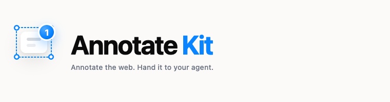

<p align="center">
  
</p>

<p align="center">
  <strong>Point at the pixel. Ship the change.</strong><br />
  Annotate a running interface — a web page or a native iOS screen — and hand your AI
  coding agent one message it can act on. Now as a Chrome extension.
</p>

<p align="center">
  <a href="https://connected-mate.github.io/annotate-kit/"><strong>See it →</strong></a>
  &nbsp;·&nbsp;
  <a href="https://connected-mate.github.io/annotate-kit/try.html"><strong>Try it on a live page →</strong></a>
</p>

---

**This repository is the front door.** It holds the website, and the map of every other
Annotate Kit repository. If you are looking for the code, it is one of the links below.

## The family

| Repository | What it is | Visibility |
| --- | --- | --- |
| **[annotate-kit](https://github.com/Connected-Mate/annotate-kit)** *(you are here)* | The website and this index. Served by GitHub Pages. | Public |
| **annotate-kit-web** | The web package and the Chrome extension. A JS/TS overlay for React, Vue, Svelte or plain HTML: annotate, restyle live in a Figma-style inspector, wireframe a component, send one agent-ready message. | Private |
| **[annotate-kit-ios](https://github.com/Connected-Mate/annotate-kit-ios)** | The Swift package. A floating annotation toolbar for SwiftUI apps in Debug builds, plus its MCP server and its Claude Code / Codex / Cursor plugin. | Public |
| **[annotate-kit-ios-demo](https://github.com/Connected-Mate/annotate-kit-ios-demo)** | *Trailhead* — a runnable iOS app that both showcases the kit and trains you to write requests an agent can execute first try. Reference integration. | Public |

## Which one do I want?

**Reviewing any website, no code to touch** → the **Chrome extension** (coming soon to the
Chrome Web Store). Switch it on per site, point, note, restyle, check phone and tablet views,
and connect your coding agent with one copied setup prompt. Free on 3 sites; Pro is a single
€15 purchase, VAT included, for every site — no subscription.
[Privacy policy](https://connected-mate.github.io/annotate-kit/privacy-extension.html).

**Mounting it inside your own web app** → the `annotate-kit` package.

```bash
npm install annotate-kit react react-dom
npx annotate-kit init
```

```ts
import { createAnnotateKit } from 'annotate-kit';

createAnnotateKit({ locale: 'en' }).mount();
```

**Building a native iOS app (SwiftUI)** → `annotate-kit-ios`.

```swift
.package(url: "https://github.com/Connected-Mate/annotate-kit-ios", from: "0.4.0")
```

```swift
MainTabView().annotationOverlay()   // inert in Release builds
```

**Want to see it work before wiring anything** → run
[`annotate-kit-ios-demo`](https://github.com/Connected-Mate/annotate-kit-ios-demo), or
[try the web version in your browser](https://connected-mate.github.io/annotate-kit/try.html).

## One idea, two implementations

Both versions share the workflow, the design language and the annotation schema: point at
an element, say what should change, and the agent receives the element's identity, its
surroundings, a marked screenshot and a written request — not a screenshot in Slack. The
implementations are independent, because a DOM node and a SwiftUI view are not pointed at
the same way.

## Licences

| | |
| --- | --- |
| **Chrome extension** | Free on 3 sites. Pro: €15 once, VAT included, every site and all future updates. |
| **annotate-kit (npm package)** | Commercial, source-available. Licensing is arranged directly — ask. |
| **annotate-kit-ios** | PolyForm Noncommercial 1.0.0 — free for noncommercial use; a commercial licence is available. Versions up to v0.4.0 remain MIT. |
| **This site** | Content and assets: all rights reserved. |

**Buy a licence, or ask for one built around your company:** WhatsApp **@alexandre.cormeraie** — or [alex.connectedmate@gmail.com](mailto:alex.connectedmate@gmail.com?subject=Annotate%20Kit).

## Want it built for you?

Annotate Kit is one answer to one problem. If you have the same problem in a different
shape — your design system, your review process, your agents — or a different project
entirely, it can be built for you rather than adapted by you.
[Say so from the site](https://connected-mate.github.io/annotate-kit/#custom) — or reach me on WhatsApp at **@alexandre.cormeraie**.

## About `annotate-kit.js` in this repo

The playground loads a **demo build**: minified, no source map, and locked to this site's
own hosts. It is not the package a licensee installs. Anything a browser runs can be
downloaded — that is true of every website — so this is a deterrent and a statement of the
licence position, not a vault.

---

© 2026 Connected Mate.
